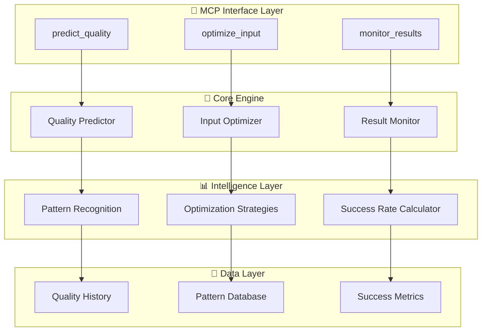

# 聚焦MCP Server设计文档

## 概览

**AI规划质量预测与优化MCP Server** 是一个专注解决AI生成开发规划质量不稳定问题的轻量级MCP服务。

核心价值：让用户在3秒内预知AI规划质量，并获得针对性优化建议，将AI规划成功率从当前的60-70%提升到90%+。

## 架构设计

### 整体架构



### 核心组件设计

#### 1. Quality Predictor (质量预测器)

**职责**: 基于输入文本预测AI生成规划的质量分数

**核心算法**:
```typescript
interface QualityPrediction {
  overallScore: number;        // 0-100总体质量分数
  confidenceLevel: number;     // 预测置信度
  riskFactors: string[];       // 风险因素
  successProbability: number;  // 成功概率
  estimatedTime: number;       // 预计处理时间
}
```

**预测维度**:
- 文本清晰度 (25%)
- 需求完整性 (30%) 
- 技术可行性 (20%)
- 商业逻辑 (15%)
- 创新程度 (10%)

#### 2. Input Optimizer (输入优化器)

**职责**: 自动生成3个优化版本的项目描述

**优化策略**:
```typescript
interface OptimizationStrategy {
  name: string;
  focus: 'technical' | 'business' | 'user';
  improvements: string[];
  expectedQualityGain: number;
}
```

**三种优化方向**:
- **技术导向**: 补充技术栈、架构、性能要求
- **商业导向**: 强化商业模式、市场分析、盈利模式  
- **用户导向**: 突出用户体验、使用场景、价值主张

#### 3. Result Monitor (结果监控器)

**职责**: 评估AI生成规划的实际质量并持续学习

**监控指标**:
```typescript
interface QualityMetrics {
  completeness: number;    // 完整性
  feasibility: number;     // 可行性
  clarity: number;         // 清晰度
  innovation: number;      // 创新性
  marketViability: number; // 市场可行性
}
```

## 数据模型

### 质量预测模型

```typescript
interface QualityModel {
  // 输入特征
  textLength: number;
  keywordDensity: Record<string, number>;
  sentenceComplexity: number;
  domainSpecificity: number;
  
  // 历史数据
  similarCases: QualityCase[];
  averageSuccessRate: number;
  
  // 预测结果
  prediction: QualityPrediction;
  recommendations: string[];
}
```

### 优化策略库

```typescript
interface OptimizationRule {
  id: string;
  trigger: string;           // 触发条件
  improvement: string;       // 改进建议
  template: string;          // 优化模板
  expectedGain: number;      // 预期提升
  successRate: number;       // 历史成功率
}
```

## 错误处理

### 分级错误处理

1. **Level 1 - 输入错误**: 立即返回错误信息和建议
2. **Level 2 - 预测失败**: 使用备用算法或历史数据
3. **Level 3 - 系统错误**: 降级到基础功能模式

### 容错机制

```typescript
interface FallbackStrategy {
  primaryMethod: () => Promise<Result>;
  fallbackMethod: () => Promise<Result>;
  emergencyResponse: () => Result;
}
```

## 测试策略

### 质量预测准确性测试

- **基准数据集**: 1000个已标注的项目描述
- **准确率目标**: 预测准确率 > 85%
- **响应时间**: < 3秒

### A/B测试框架

```typescript
interface ABTest {
  name: string;
  variants: {
    control: OptimizationStrategy;
    treatment: OptimizationStrategy;
  };
  metrics: string[];
  sampleSize: number;
}
```

### 性能基准

| 指标 | 目标值 | 当前值 |
|------|--------|--------|
| 质量预测时间 | < 3秒 | - |
| 预测准确率 | > 85% | - |
| 优化建议生成 | < 5秒 | - |
| 内存使用 | < 100MB | - |
| 并发支持 | 50+ | - |

## 部署架构

### 轻量化部署

```yaml
# docker-compose.yml
version: '3.8'
services:
  mcp-server:
    build: .
    ports:
      - "3000:3000"
    environment:
      - NODE_ENV=production
      - CACHE_SIZE=1000
    volumes:
      - ./data:/app/data
    restart: unless-stopped
```

### 配置管理

```typescript
interface ServerConfig {
  prediction: {
    modelPath: string;
    cacheSize: number;
    timeout: number;
  };
  optimization: {
    strategiesPath: string;
    maxVariants: number;
  };
  monitoring: {
    metricsRetention: number;
    alertThresholds: Record<string, number>;
  };
}
```

## 安全考虑

### 数据隐私

- 输入文本不存储原始内容，仅保留特征向量
- 质量评分数据匿名化处理
- 支持用户数据删除请求

### API安全

```typescript
interface SecurityConfig {
  rateLimit: {
    windowMs: number;
    maxRequests: number;
  };
  validation: {
    maxInputLength: number;
    allowedCharacters: RegExp;
  };
  monitoring: {
    suspiciousPatterns: string[];
    alertWebhook: string;
  };
}
```

## 扩展性设计

### 插件化架构

```typescript
interface QualityPlugin {
  name: string;
  version: string;
  evaluate: (input: string) => Promise<number>;
  optimize: (input: string) => Promise<string>;
}
```

### 多语言支持

- 中文优先，英文支持
- 可扩展的语言检测和处理
- 本地化的优化策略

## 监控与运维

### 关键指标

```typescript
interface SystemMetrics {
  performance: {
    avgResponseTime: number;
    errorRate: number;
    throughput: number;
  };
  quality: {
    predictionAccuracy: number;
    userSatisfaction: number;
    improvementRate: number;
  };
  business: {
    dailyActiveUsers: number;
    successfulOptimizations: number;
    qualityImprovementAvg: number;
  };
}
```

### 告警策略

- 预测准确率下降 > 10%
- 响应时间超过 5秒
- 错误率超过 5%
- 内存使用超过 200MB