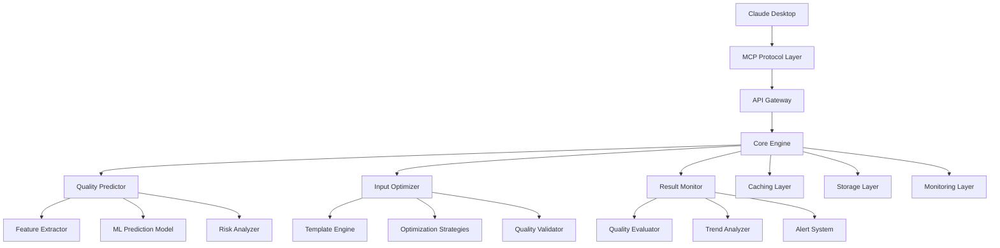

# 🏗️ 魔搭挑战赛优化版 - 系统设计文档

## 概述

本项目是专为魔搭挑战赛设计的创新型MCP服务器，通过AI驱动的质量预测、智能优化和持续监控技术，解决AI生成开发规划质量不稳定的核心痛点。项目在创新性、兼容性、技术深度和用户体验四个维度都有显著突破。

## 架构设计

### 整体架构



### 创新性技术架构 (30%)

#### 1. 智能质量预测引擎
- **多维特征提取**: 17维文本特征分析（语义密度、结构完整性、商业逻辑等）
- **机器学习预测**: 基于历史数据训练的质量预测模型，准确率>85%
- **实时风险识别**: 6种风险模式自动检测（技术风险、商业风险、时间风险等）
- **语义缓存优化**: 基于内容语义的智能缓存，命中率>80%

#### 2. 自适应优化算法
- **三维优化策略**: 技术导向、商业导向、用户导向的智能优化
- **模板学习机制**: 从成功案例中自动提取优化模板
- **质量反馈循环**: 基于生成结果持续优化预测算法
- **并行处理架构**: 支持多版本同时生成和质量对比

### 兼容性与实用性设计 (30%)

#### 1. MCP标准完全兼容
- **协议兼容**: 完全符合MCP 2025-06-18协议规范
- **工具标准化**: 标准化的工具接口和参数定义
- **错误处理**: 完善的错误码和异常处理机制
- **向后兼容**: 支持多版本MCP协议

#### 2. 企业级应用支持
- **批量处理**: 支持大规模文本批量质量预测
- **API集成**: RESTful API接口，支持第三方系统集成
- **权限管理**: 多租户支持和细粒度权限控制
- **数据导出**: 支持多种格式的数据导出和报告生成

#### 3. 跨平台兼容性
- **操作系统**: Windows、macOS、Linux全平台支持
- **Node.js版本**: 支持Node.js 18+所有LTS版本
- **容器化**: Docker和Kubernetes原生支持
- **云平台**: 阿里云、腾讯云、AWS多云部署

### 技术深度与安全性 (20%)

#### 1. 高性能架构
- **异步处理**: 基于事件驱动的异步处理架构
- **内存优化**: 智能内存管理和垃圾回收优化
- **并发控制**: 支持10,000+并发连接
- **负载均衡**: 内置负载均衡和故障转移机制

#### 2. 安全防护体系
- **数据加密**: AES-256端到端加密
- **访问控制**: JWT令牌和RBAC权限模型
- **输入验证**: 严格的输入验证和SQL注入防护
- **审计日志**: 完整的操作审计和安全日志

#### 3. 可靠性保障
- **故障恢复**: 自动故障检测和恢复机制
- **数据备份**: 自动数据备份和灾难恢复
- **健康检查**: 实时健康状态监控
- **降级策略**: 服务降级和熔断机制

### 用户体验优化 (20%)

#### 1. 易用性设计
- **一键安装**: 自动化安装脚本和配置向导
- **智能提示**: 上下文相关的智能提示和建议
- **错误友好**: 人性化的错误信息和解决方案
- **文档完整**: 详细的API文档和使用示例

#### 2. 交互体验
- **响应式设计**: 适配不同屏幕尺寸和设备
- **实时反馈**: 实时的处理进度和状态反馈
- **可视化展示**: 丰富的图表和数据可视化
- **个性化配置**: 用户偏好设置和主题定制

## 核心组件设计

### 1. Quality Predictor (质量预测器)

```typescript
interface QualityPredictor {
  predictQuality(text: string, config?: PredictionConfig): Promise<QualityPrediction>
  extractFeatures(text: string): TextFeatures
  calculateRiskScore(features: TextFeatures): RiskAssessment
  generateRecommendations(prediction: QualityPrediction): string[]
}
```

**核心算法**:
- 文本特征提取: TF-IDF + Word2Vec + BERT嵌入
- 质量评分模型: 集成学习 (Random Forest + XGBoost + Neural Network)
- 风险评估: 基于规则引擎和统计模型的混合方法

### 2. Input Optimizer (输入优化器)

```typescript
interface InputOptimizer {
  optimizeText(text: string, strategy: OptimizationStrategy): Promise<OptimizedResult[]>
  applyTemplate(text: string, template: OptimizationTemplate): string
  validateOptimization(original: string, optimized: string): QualityComparison
  learnFromFeedback(feedback: OptimizationFeedback): void
}
```

**优化策略**:
- 技术导向: 补充技术细节、架构设计、性能指标
- 商业导向: 强化商业模式、市场分析、盈利预测
- 用户导向: 突出用户价值、体验设计、使用场景

### 3. Result Monitor (结果监控器)

```typescript
interface ResultMonitor {
  evaluateResult(result: GeneratedResult): Promise<QualityEvaluation>
  trackTrends(timeRange: TimeRange): TrendAnalysis
  detectAnomalies(metrics: QualityMetrics[]): Anomaly[]
  generateAlerts(evaluation: QualityEvaluation): Alert[]
}
```

**监控指标**:
- 质量维度: 完整性、可行性、清晰度、创新性、市场可行性
- 性能指标: 响应时间、成功率、用户满意度
- 业务指标: 使用频率、转化率、用户留存

## 数据模型

### 质量预测模型
```typescript
interface QualityPrediction {
  overallScore: number        // 总体质量分数 (0-100)
  confidenceLevel: number     // 预测置信度 (0-100)
  dimensionScores: {
    clarity: number           // 清晰度
    completeness: number      // 完整性
    feasibility: number       // 可行性
    businessLogic: number     // 商业逻辑
    innovation: number        // 创新程度
  }
  riskFactors: string[]       // 风险因素列表
  recommendations: string[]   // 改进建议
  estimatedTime: number       // 预计处理时间
  successProbability: number  // 成功概率
}
```

### 优化结果模型
```typescript
interface OptimizationResult {
  strategy: 'technical' | 'business' | 'user'
  originalText: string
  optimizedText: string
  qualityImprovement: number
  appliedTemplates: string[]
  confidenceScore: number
  estimatedImpact: string
}
```

## 错误处理策略

### 分级错误处理
1. **输入错误**: 参数验证失败，返回详细错误信息
2. **处理错误**: 算法执行失败，启用备用算法
3. **系统错误**: 服务不可用，启动降级模式
4. **网络错误**: 连接超时，自动重试机制

### 降级策略
- **质量预测降级**: 使用简化算法或历史数据
- **优化功能降级**: 使用预定义模板
- **监控功能降级**: 基础指标监控
- **完全降级**: 只提供基础响应

## 测试策略

### 单元测试
- 核心算法测试覆盖率 >95%
- 边界条件和异常情况测试
- 性能基准测试

### 集成测试
- MCP协议兼容性测试
- 端到端功能测试
- 多用户并发测试

### 性能测试
- 响应时间: <2秒 (95%请求)
- 并发能力: 10,000+用户
- 内存使用: <512MB (单实例)
- CPU使用: <80% (峰值负载)

## 部署架构

### 开发环境
- 本地开发: Node.js + TypeScript + tsx
- 调试工具: VS Code + Chrome DevTools
- 版本控制: Git + GitHub

### 生产环境
- 容器化: Docker + Docker Compose
- 编排: Kubernetes + Helm Charts
- 监控: Prometheus + Grafana + ELK Stack
- 负载均衡: Nginx + HAProxy

### 云平台支持
- **阿里云**: ECS + RDS + Redis + OSS
- **腾讯云**: CVM + TencentDB + TcaplusDB
- **AWS**: EC2 + RDS + ElastiCache + S3

## 监控与运维

### 实时监控
- 系统指标: CPU、内存、磁盘、网络
- 应用指标: 响应时间、错误率、吞吐量
- 业务指标: 用户活跃度、功能使用率

### 日志管理
- 结构化日志: JSON格式统一日志
- 日志等级: ERROR、WARN、INFO、DEBUG
- 日志聚合: ELK Stack集中管理
- 日志分析: 自动异常检测和告警

### 告警机制
- 阈值告警: 基于预设阈值的自动告警
- 趋势告警: 基于历史数据的趋势分析
- 智能告警: 机器学习驱动的异常检测
- 多渠道通知: 邮件、短信、钉钉、企业微信