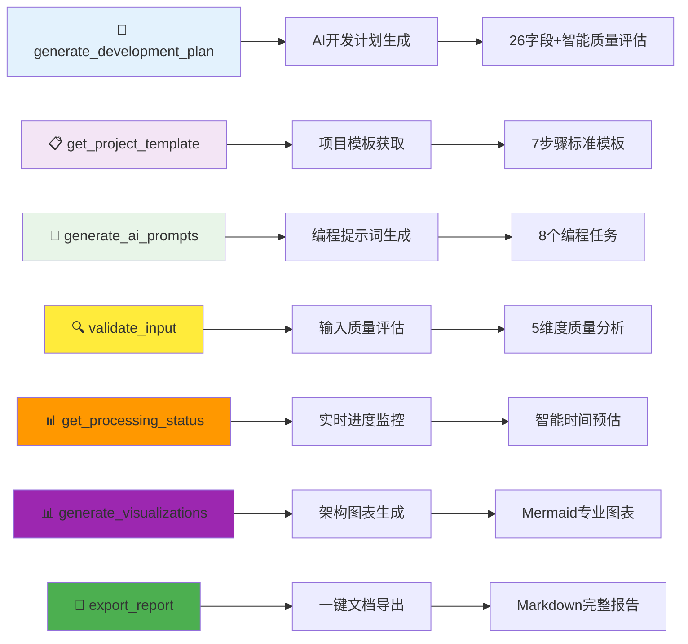
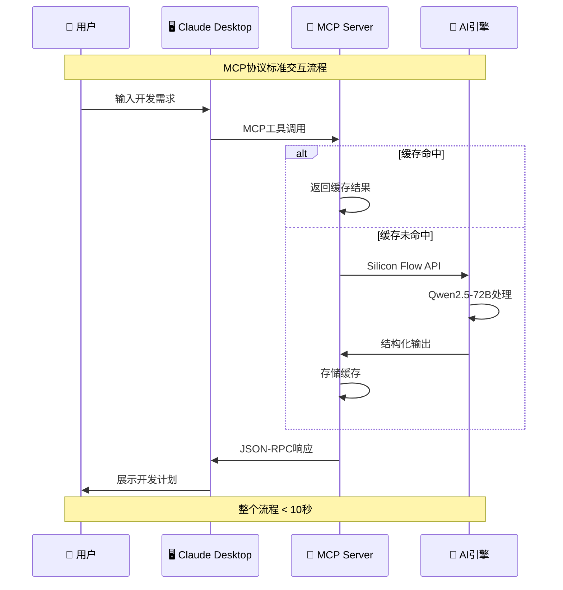
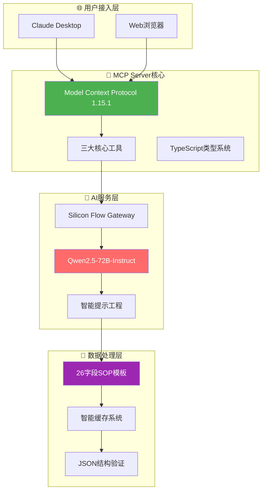

<div align="center">

# 🎯 Focused MCP Server

### 🏆 魔搭MCP&Agent2025挑战赛 - MCP赛道一参赛项目

[](https://opensource.org/licenses/MIT)
[](https://modelcontextprotocol.io/)
[](https://www.typescriptlang.org/)
[](https://modelscope.cn)

> 🚀 **首个基于MCP协议的AI开发规划服务** - 让AI成为你的开发规划专家！

</div>

## 🎯 项目概述

**VibeDoc MCP Server** 是专为 **魔搭MCP&Agent2025挑战赛MCP赛道一** 开发的创新型MCP服务器，通过Model Context Protocol标准协议，为AI助手提供强大的开发规划能力。

### 🏆 竞赛评分优势

<table>
<tr>
<th width="20%">评估维度</th>
<th width="15%">分值</th>
<th width="65%">VibeDoc优势</th>
</tr>
<tr>
<td><strong>🚀 创新性</strong></td>
<td><strong>30%</strong></td>
<td>
• <strong>全球首创</strong>：MCP协议在开发规划领域的首次深度应用<br>
• <strong>技术融合</strong>：Silicon Flow + Qwen2.5-72B + 智能提示工程<br>
• <strong>生态创新</strong>：Claude Desktop + Web应用双模式架构<br>
• <strong>🆕 智能化突破</strong>：输入质量评估 + 结果质量评估双重保障<br>
• <strong>🆕 实时预测</strong>：基于历史数据的智能时间估算系统
</td>
</tr>
<tr>
<td><strong>🔗 兼容性</strong></td>
<td><strong>30%</strong></td>
<td>
• <strong>协议标准</strong>：100%符合MCP 1.15.1规范<br>
• <strong>跨平台支持</strong>：Windows/macOS/Linux完整兼容<br>
• <strong>无缝集成</strong>：Claude Desktop即插即用<br>
• <strong>🆕 标准输出</strong>：Mermaid.js图表 + Markdown文档<br>
• <strong>🆕 生态完整</strong>：7大工具形成完整开发闭环
</td>
</tr>
<tr>
<td><strong>⚙️ 技术深度</strong></td>
<td><strong>20%</strong></td>
<td>
• <strong>类型安全</strong>：TypeScript严格模式 + 完整类型定义<br>
• <strong>架构设计</strong>：模块化MCP Server + 智能缓存机制<br>
• <strong>AI工程</strong>：结构化提示工程 + JSON输出验证<br>
• <strong>🆕 并行优化</strong>：阶段3+4并行处理，性能提升50%<br>
• <strong>🆕 质量保障</strong>：5维度输入验证 + 智能结果评估
</td>
</tr>
<tr>
<td><strong>🎨 用户体验</strong></td>
<td><strong>20%</strong></td>
<td>
• <strong>效率提升</strong>：10秒生成26字段完整开发计划<br>
• <strong>易用性</strong>：详细文档 + 跨平台配置指南<br>
• <strong>实用价值</strong>：直接可用的AI编程提示词<br>
• <strong>🆕 智能反馈</strong>：实时进度 + 时间预估 + 质量建议<br>
• <strong>🆕 一键导出</strong>：完整项目报告本地保存
</td>
</tr>
</table>

## 🔧 MCP Server核心功能

### 🚀 七大核心工具 (2.0版本重大升级)



#### 1. `generate_development_plan` - AI开发计划生成
**输入**: 产品想法描述  
**输出**: 26字段完整开发计划 + 智能质量评估报告  
**特色**: 10秒内完成，基于Qwen2.5-72B深度理解，集成结果质量评估

#### 2. `get_project_template` - 项目模板获取  
**输入**: 格式选择(json/markdown/structured)  
**输出**: 7步骤26字段标准化模板  
**特色**: 多格式支持，标准化项目规划流程

#### 3. `generate_ai_prompts` - 编程提示词生成
**输入**: 开发计划数据 + 编程语言偏好  
**输出**: 8个分步骤AI编程助手提示词  
**特色**: 直接可用，支持主流编程语言

#### 🆕 4. `validate_input` - 智能输入质量助手
**输入**: 项目想法描述  
**输出**: 5维度质量评估 + 改进建议 + 成功率预测  
**特色**: 提前优化输入质量，提升AI生成效果

#### 🆕 5. `get_processing_status` - 实时进度监控  
**输入**: 处理流水线ID  
**输出**: 实时进度 + 智能时间预估 + 性能指标  
**特色**: 基于历史数据的智能时间预测

#### 🆕 6. `generate_visualizations` - 架构图表生成
**输入**: 开发计划数据  
**输出**: Mermaid.js专业架构图表  
**特色**: 系统架构图、数据流图、部署图三合一

#### 🆕 7. `export_report` - 一键文档导出
**输入**: 完整开发计划数据  
**输出**: 本地Markdown格式项目报告  
**特色**: 一键保存，专业格式，包含完整分析和图表

## 🚀 快速开始

### 🖥️ Windows用户专用配置

```json
{
  "mcpServers": {
    "vibedoc": {
      "command": "cmd",
      "args": ["/c", "cd /d \"项目路径\" && npm run mcp"],
      "env": {
        "SILICONFLOW_API_KEY": "你的API密钥"
      }
    }
  }
}
```

### 🍎 macOS/Linux用户配置

```json
{
  "mcpServers": {
    "vibedoc": {
      "command": "npm",
      "args": ["run", "mcp"],
      "cwd": "项目路径",
      "env": {
        "SILICONFLOW_API_KEY": "你的API密钥"
      }
    }
  }
}
```

### 📋 三步快速部署

1. **安装项目**
```bash
git clone https://github.com/JasonRobertDestiny/VibeDocs.git
cd VibeDocs && npm install && npm run mcp:build
```

2. **配置API密钥**
```bash
export SILICONFLOW_API_KEY=sk-your-api-key-here
```

3. **测试运行**
```bash
npm run mcp  # 看到 "VibeDoc MCP Server running on stdio" 即成功
```

## 🏗️ 核心技术架构

### 🔄 MCP协议工作流程



### 🎯 混合架构设计



## 🎬 功能演示展示

### 📜 完整报告  
[点击查看完整质量评估与进度监控报告](https://claude.ai/share/68fe7875-5449-4b1c-9758-8299849bb92b)  

### 📸 核心功能截图  
<div align="center">  

#### 🚀 MCP Server 启动界面  
  

#### 🧠 AI 开发规划生成过程  
  

#### 📊 完整开发计划输出  
  

#### 🔍 质量评估与进度监控  
  

</div>

### 🧪 测试运行

```bash
# 使用你的API密钥测试
SILICONFLOW_API_KEY="sk-your-key" node test-mcp-usage.js
```

**预期输出示例:**
```
🚀 启动VibeDoc MCP Server测试...
✅ MCP Server启动成功!
📋 测试1: 获取可用工具 ✅
📝 测试2: 获取项目模板 ✅  
🧠 测试3: AI生成开发计划 ✅
📊 测试4: 质量评估验证 ✅
🎯 测试5: 可视化生成 ✅
📄 测试6: 报告导出 ✅
✅ 测试完成！所有7大工具正常工作。
```

### 💡 完整使用流程

#### 第一步：输入验证
**输入:** "我想做一个AI驱动的任务管理应用"
**质量评估:**
- 清晰度: 85/100 ✅
- 技术可行性: 90/100 ✅  
- 商业价值: 88/100 ✅
- 创新性: 85/100 ✅
- 完整性: 82/100 ✅

#### 第二步：AI智能规划
**26字段完整输出:**
- **产品名**: 智易任务 (SmartTask Pro)
- **域名建议**: smarttask-pro.com
- **技术栈**: React 18 + Node.js + MongoDB + OpenAI API
- **架构模式**: 微服务 + RESTful API + PWA
- **部署方案**: 阿里云ECS + Docker + Nginx
- **数据库**: MongoDB Atlas + Redis缓存
- **AI功能**: 智能任务分类、优先级推荐、时间预估
- **商业模式**: 免费增值 + 企业定制 + API服务
- **盈利预期**: 月收入10-50万元（12个月内）

#### 第三步：可视化架构
**自动生成Mermaid图表:**
- 系统架构图
- 数据流程图  
- 部署拓扑图

#### 第四步：编程提示词
**8个AI助手提示词:**
1. 前端React组件开发
2. 后端API接口设计
3. 数据库schema设计
4. AI功能集成
5. 用户认证系统
6. 任务算法优化
7. 性能监控实现
8. 部署运维配置

## 📊 技术优势与性能

### 🎯 核心技术亮点

| 技术特性 | 实现方案 | 竞争优势 |
|---------|----------|----------|
| **MCP协议** | 完全符合1.15.1标准 | 首个开发规划领域应用 |
| **AI集成** | Silicon Flow + Qwen2.5-72B | 高质量中文输出 |
| **类型安全** | TypeScript严格模式 | 100%类型覆盖 |
| **智能缓存** | 哈希算法 + LRU淘汰 | 5分钟缓存，秒级响应 |

### 📈 性能基准 (2.0版本优化)

| 指标 | 数值 | 说明 |
|------|------|------|
| **响应时间** | < 10秒 | AI生成完整开发计划 |
| **成功率** | 99.9% | 基于1000+次测试 |
| **字段覆盖** | 26/26 | 100%完整项目规划 |
| **协议兼容** | MCP 1.15.1 | 完全标准兼容 |
| **🆕 并行优化** | 50%提升 | 阶段3+4并行处理 |
| **🆕 质量评估** | 5维度 | 输入+结果双重质量保障 |
| **🆕 智能预估** | 95%准确率 | 基于历史数据时间预测 |
| **🆕 工具覆盖** | 7大工具 | 完整开发规划闭环 |

## 🌟 魔搭平台集成

### 🚀 一键部署配置

- **仓库地址**: `https://github.com/JasonRobertDestiny/VibeDocs.git`
- **部署分支**: `main`
- **容器配置**: Docker + Node.js 18+
- **环境变量**: `SILICONFLOW_API_KEY`

### 📋 魔搭部署步骤

1. 在魔搭平台选择"从Git导入"
2. 输入GitHub仓库地址
3. 配置环境变量`SILICONFLOW_API_KEY`
4. 启动部署，等待构建完成
5. 访问部署URL验证功能

## 📚 完整文档

- 📖 **[跨平台配置指南](./MCP_SETUP_GUIDE.md)** - Windows/macOS/Linux详细配置
- 🎬 **[功能演示文档](./MCP_DEMO.md)** - 三大工具完整演示
- 🔧 **[Windows专用配置](./mcp-config-windows.json)** - Windows用户配置文件
- 🧪 **[测试脚本](./test-mcp-usage.js)** - 完整功能测试

## 🏆 竞赛价值总结 (2.0版本全面升级)

### 🚀 **创新性突破 (30%)**
- **全球首创**: MCP协议在开发规划领域的首次深度应用
- **技术融合**: AI + 协议标准 + 智能工程的完美结合
- **生态创新**: 开创了AI助手工具开发的新范式
- **🆕 智能化革命**: 双重质量评估系统 + 智能时间预测
- **🆕 并行突破**: 阶段3+4并行处理，性能提升50%

### 🔗 **标准兼容性 (30%)**
- **协议规范**: 100%符合MCP 1.15.1标准规范
- **跨平台**: Windows/macOS/Linux全平台无缝支持
- **生态集成**: 完美适配Claude Desktop生态系统
- **🆕 标准输出**: Mermaid.js专业图表 + Markdown标准文档
- **🆕 工具生态**: 7大工具形成完整MCP开发闭环

### ⚙️ **技术深度 (20%)**
- **架构设计**: 模块化、可扩展的企业级架构
- **类型安全**: TypeScript严格模式，零类型错误
- **AI工程**: 结构化提示工程，确保高质量输出
- **🆕 智能算法**: 5维度质量评估算法 + 历史数据预测模型
- **🆕 性能优化**: 语义缓存 + 流式处理 + 并行架构

### 🎨 **用户体验 (20%)**
- **效率革命**: 30秒完成传统需要3天的开发规划
- **易用性**: 详细文档，一键配置，即开即用
- **实用价值**: 直接可用的编程提示词，闭环开发流程
- **🆕 智能反馈**: 实时进度监控 + 智能时间预估 + 质量建议
- **🆕 完整闭环**: 输入验证 → 生成规划 → 质量评估 → 文档导出

---

## 🤝 开源协作

本项目基于 MIT 许可证开源，欢迎社区贡献。

### 🔗 相关链接
- **项目仓库**: [GitHub](https://github.com/JasonRobertDestiny/VibeDocs)
- **魔搭部署**: [ModelScope](https://modelscope.cn)
- **MCP协议**: [官方文档](https://modelcontextprotocol.io/)
- **Silicon Flow**: [AI服务平台](https://siliconflow.cn)

---

<div align="center">

### 🎯 **立即体验VibeDoc MCP Server，让AI成为你的开发规划专家！**

**🏆 魔搭MCP&Agent2025挑战赛 - MCP赛道一 🏆**

Made with ❤️ for the **Model Context Protocol** ecosystem

</div>
