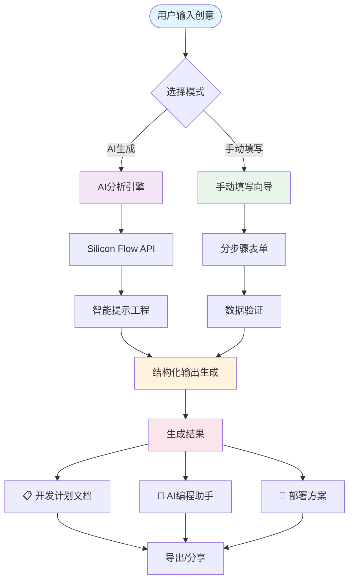
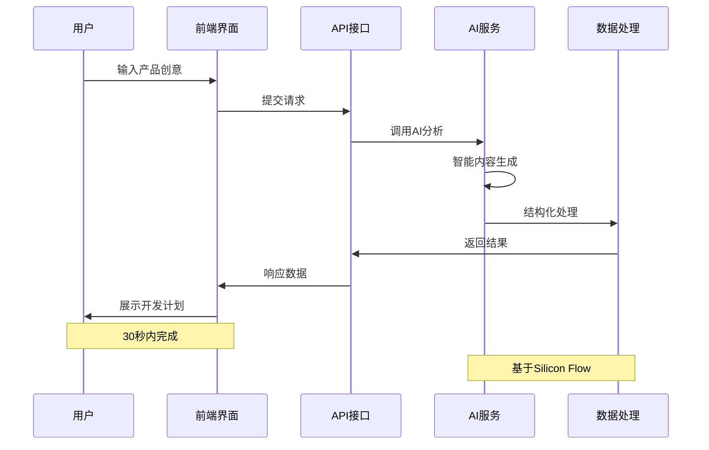

<div align="center">

# 🚀 VibeDoc - AI驱动的开发计划生成器

### 🔥 一键将创意转化为完整开发方案！

[](https://opensource.org/licenses/MIT)
[](https://nextjs.org/)
[](https://www.typescriptlang.org/)
[](https://modelscope.cn)

> 🏆 **参赛项目** - 魔搭AI Hackathon 2025 - 赛道一：MCP Server开发赛道

</div>

## 🎯 项目简介

VibeDoc 是一个基于 AI 的智能开发计划生成工具，专为魔搭AI Hackathon 2025 MCP Server开发赛道设计。帮助开发者和产品经理快速将创意转化为完整的技术开发方案。

**核心能力：**
- 🧠 **AI 智能生成**：30秒内将创意转化为完整开发计划
- 🛠️ **双模式支持**：AI生成与手动填写模式自由切换
- 📋 **结构化输出**：标准化的项目规划文档
- 🤖 **AI编程助手**：生成可直接使用的编程提示词

## 🎬 系统架构与流程图

<div align="center">

### 🔄 核心工作流程



### 🏗️ 系统架构图

```mermaid
graph LR
    subgraph "前端层"
        A[React 19] --> B[Next.js 15]
        B --> C[TypeScript]
        C --> D[Tailwind CSS]
        D --> E[Shadcn/UI]
    end
    
    subgraph "API层"
        F[API Routes] --> G[数据验证]
        G --> H[业务逻辑]
    end
    
    subgraph "AI服务层"
        I[Silicon Flow API] --> J[Qwen2.5-72B]
        J --> K[智能提示工程]
    end
    
    subgraph "部署层"
        L[Docker容器] --> M[魔塔ModelScope]
        M --> N[云端服务]
    end
    
    E --> F
    H --> I
    K --> L
    
    style A fill:#61dafb
    style B fill:#000000
    style C fill:#3178c6
    style I fill:#ff6b6b
    style L fill:#0db7ed
```



### 📊 数据流向图



</div>

## 🎬 功能演示

### 💫 AI 生成模式 - 智能化体验

```
用户输入："我想做一个在线协作文档工具"
       ↓ (30秒AI分析)
自动生成：
├── 📋 产品规划 (痛点分析、功能设计、商业模式)
├── 🛠️ 技术方案 (React + Node.js + MongoDB)
├── 🚀 部署运维 (Docker + 云平台 + 性能优化)
├── 📈 营销策略 (用户增长、数据分析)
└── 🤖 AI 助手 (分步骤编程提示词)
```

### 🛠️ 手动填写模式 - 精确控制

- **步骤1**: 产品基本信息
- **步骤2**: 技术栈选择
- **步骤3**: 部署方案
- **步骤4**: 营销策略
- **随时切换**: 一键返回AI生成模式

## 🔥 应用场景

### 🎯 创业者
- **快速验证想法**：30秒获得完整的技术可行性分析
- **方案展示**：专业的技术方案文档
- **团队协作**：清晰的开发计划和时间线

### 👨‍💻 开发者
- **项目启动**：标准化的技术栈选择
- **架构设计**：专业的系统架构建议
- **AI 编程助手**：直接可用的编程提示词

### 🏢 产品经理
- **需求分析**：结构化的功能设计文档
- **技术沟通**：与开发团队的有效沟通工具
- **项目规划**：详细的开发计划和里程碑

## 🚀 快速体验

### 📱 使用步骤
1. **输入创意** → 描述你的产品想法
2. **AI 分析** → 30秒智能生成方案
3. **获得结果** → 完整的开发计划文档
4. **开始编程** → 使用生成的AI助手提示词

## 🏗️ 技术架构

### 🎨 前端技术栈
- **Next.js 15** - 🚀 React 全栈框架（最新版本）
- **React 19** - ⚛️ 最先进的用户界面库
- **TypeScript** - 🔒 类型安全的 JavaScript
- **Tailwind CSS 4** - 🎨 现代化原子CSS框架
- **Shadcn/UI** - 🎭 精美的组件库

### 🧠 AI 技术栈
- **Silicon Flow API** - 🌊 高性能大语言模型服务
- **Qwen2.5-72B-Instruct** - 🤖 智能内容生成模型
- **结构化提示工程** - 🎯 确保高质量输出

### ⚡ 性能优化
- **Turbopack** - 🚄 极速构建工具
- **SSR/SSG** - 🏃‍♂️ 服务端渲染优化
- **CDN 加速** - 🌍 全球内容分发

## 🎯 MCP Server 赛道亮点

### 🌟 创新性
- **AI + 开发流程**：深度融合AI能力到软件开发全流程
- **智能化工具**：自动化复杂的项目规划过程
- **开发者工具**：生成直接可用的编程助手提示词

### 💎 技术价值
- **模型集成**：展示大语言模型在垂直领域的深度应用
- **工程实践**：完整的前端 + AI 后端架构设计
- **用户体验**：直观的交互界面和流畅的使用流程

### 🔧 实用性
- **解决痛点**：帮助开发者快速启动项目，减少80%规划时间
- **提高效率**：标准化的开发计划模板
- **知识沉淀**：可复用的项目规划方法论

## 🌈 魔塔平台部署指南

### 🚀 部署配置

**项目仓库：** `https://github.com/JasonRobertDestiny/VibeDocs.git`  
**分支：** `modelscope`  
**SDK：** `Docker`  
**端口：** `3000`  

### ⚙️ 正确的服务配置

**重要提醒：** 请使用以下配置来解决MCP服务连接问题：

```json
{
  "mcpServers": {
    "vibedoc": {
      "command": "sh",
      "args": [
        "-c",
        "npm run build && npm start"
      ],
      "env": {
        "NODE_ENV": "production",
        "PORT": "3000",
        "SILICONFLOW_API_KEY": "${SILICONFLOW_API_KEY}"
      }
    }
  }
}
```

**配置说明：**
- 使用 `sh` 命令来执行链式操作
- 先执行 `npm run build` 构建项目
- 构建成功后执行 `npm start` 启动服务
- 确保环境变量正确传递

### 🔧 环境变量配置

| 变量名 | 描述 | 示例值 | 是否必填 |
|--------|------|--------|----------|
| `SILICONFLOW_API_KEY` | Silicon Flow API密钥，用于AI内容生成 | `sk-xxx...` | ✅ 必填 |
| `NODE_ENV` | Node.js运行环境 | `production` | ✅ 必填 |
| `PORT` | 应用服务端口 | `3000` | ✅ 必填 |

### 📋 部署步骤

1. **导入项目**：使用 GitHub 仓库地址
2. **选择分支**：`modelscope`
3. **配置服务**：复制上面的正确服务配置JSON
4. **设置环境变量**：按上表配置所有必需变量
5. **启动部署**：等待构建和启动完成
6. **验证部署**：访问应用并测试功能

### 🛠️ 常见问题解决

**问题1：MCP服务连接失败**
- **原因**：缺少构建步骤，直接执行 `npm start` 失败
- **解决**：使用上面提供的正确服务配置

**问题2：环境变量未生效**
- **原因**：环境变量名称不匹配或未正确设置
- **解决**：确保环境变量名称与代码中使用的完全一致

**问题3：端口占用或无法访问**
- **原因**：端口配置不正确
- **解决**：确保 `PORT` 环境变量设置为 `3000`

### 🎯 服务描述配置

```
VibeDoc 是一个AI驱动的智能开发计划生成器，专为魔搭AI Hackathon 2025 MCP Server开发赛道设计。

🔥 核心功能：
• 一键将创意转化为完整开发方案
• 基于Silicon Flow API的智能内容生成
• 30秒内生成包含技术栈、架构设计、部署方案的完整文档
• 自动生成AI编程助手提示词
• 支持手动填写和AI生成双模式

🎯 技术亮点：
• Next.js 15 + React 19 现代化前端架构
• TypeScript 全栈类型安全
• Tailwind CSS 4 + Shadcn/UI 精美界面
• 结构化AI提示工程，确保高质量输出
• 响应式设计，支持多设备访问

🏆 赛道价值：
• 展示MCP Server在开发工具领域的创新应用
• 深度集成大语言模型，提升开发效率
• 标准化项目规划流程，推动行业最佳实践

适用于创业者、开发者、产品经理等角色，解决项目规划难题，提升开发效率。
```

## 🛠️ 本地开发

### 📋 环境要求
- Node.js 18+
- npm 或 yarn 或 pnpm

### 🚀 快速启动

```bash
# 1. 克隆项目
git clone https://github.com/JasonRobertDestiny/VibeDocs.git
cd VibeDocs

# 2. 切换到modelscope分支
git checkout modelscope

# 3. 安装依赖
npm install

# 4. 配置环境变量
cp .env.local.example .env.local
# 编辑 .env.local 文件，添加你的 Silicon Flow API Key

# 5. 启动开发服务器
npm run dev

# 6. 访问应用
# 打开 http://localhost:3000
```

### 🔑 API Key 配置

在 `.env.local` 文件中配置：
```env
SILICONFLOW_API_KEY=your_api_key_here
```

> 💡 **提示**：在 [Silicon Flow](https://siliconflow.cn) 注册并获取免费的 API Key

### 📁 项目结构

```
VibeDocs/
├── 🎯 app/                    # Next.js App Router
│   ├── 🔌 api/               # API 路由
│   │   └── auto-generate-plan/  # AI 生成接口
│   ├── 🎨 globals.css        # 全局样式
│   ├── 📄 layout.tsx         # 根布局
│   └── 🏠 page.tsx          # 主页面
├── 🧩 components/            # React 组件
│   └── 💎 ui/               # UI 组件库
├── 🛠️ lib/                   # 工具库
│   ├── 📋 sop-template.ts   # 开发计划模板
│   └── 🔧 utils.ts          # 工具函数
├── 📂 public/               # 静态资源
└── ⚙️ 配置文件...
```

## 🔌 API 接口

### POST /api/auto-generate-plan

🎯 **功能**：根据用户输入的创意生成完整的开发计划

**请求示例：**
```json
{
  "idea": "我想做一个在线协作文档工具，类似于腾讯文档"
}
```

**响应示例：**
```json
{
  "success": true,
  "plan": {
    "productName": "DocuShare - 智能协作文档平台",
    "techStack": "React + Node.js + MongoDB + Socket.io",
    "deploymentPlan": "Docker + 云平台 + MongoDB Atlas",
    "marketingStrategy": "社交媒体推广 + 免费试用 + 企业客户",
    "aiAssistant": "分步骤编程提示词..."
  },
  "originalIdea": "我想做一个在线协作文档工具，类似于腾讯文档",
  "fieldIds": ["product", "tech", "deployment", "marketing", "ai"]
}
```

## 🏆 赛道价值展示

### 🎯 解决的核心痛点

| 痛点 | 传统方式 | VibeDoc 解决方案 |
|------|----------|------------------|
| 📋 **项目规划耗时** | 2-3天制定方案 | 30秒AI生成 |
| 🤔 **技术选型困难** | 需要大量调研 | 智能推荐最佳方案 |
| 📖 **文档编写复杂** | 手动编写，格式混乱 | 结构化专业文档 |
| 🚀 **部署方案缺失** | 缺乏系统性规划 | 完整部署运维方案 |
| 🤖 **AI助手配置** | 需要专业知识 | 自动生成提示词 |

### 💡 创新技术应用

- **🧠 智能提示工程**：精心设计的 Prompt 模板，确保高质量结构化输出
- **🔄 双模式切换**：AI生成与手动填写无缝切换，满足不同需求
- **📊 数据可视化**：清晰的项目规划图表和时间线
- **🎨 现代化界面**：基于 Shadcn/UI 的精美用户界面

## 🤝 参与贡献

### 🎯 如何贡献

我们欢迎所有形式的贡献！

- 🐛 **报告 Bug**：发现问题请提交 Issue
- 💡 **功能建议**：有好想法请告诉我们
- 🛠️ **代码贡献**：提交 Pull Request
- 📖 **文档改进**：帮助完善文档

### 📋 贡献流程

1. **Fork 项目** 🍴
2. **创建功能分支** 🌿
   ```bash
   git checkout -b feature/amazing-feature
   ```
3. **提交代码** 💾
   ```bash
   git commit -m 'Add amazing feature'
   ```
4. **推送分支** 🚀
   ```bash
   git push origin feature/amazing-feature
   ```
5. **创建 Pull Request** 📝

## 📄 许可证

本项目基于 MIT 许可证开源 - 详见 [LICENSE](LICENSE) 文件

## 📞 联系方式

<div align="center">

[](https://github.com/JasonRobertDestiny/VibeDocs)

</div>

---

<div align="center">

### 🎯 **立即体验 VibeDoc，30秒内获得完整开发方案！**

**⭐ 如果这个项目对你有帮助，请给个 Star ⭐**

Made with ❤️ for **MCP Server Development Track**

🏆 **魔搭AI Hackathon 2025** 🏆

</div>
