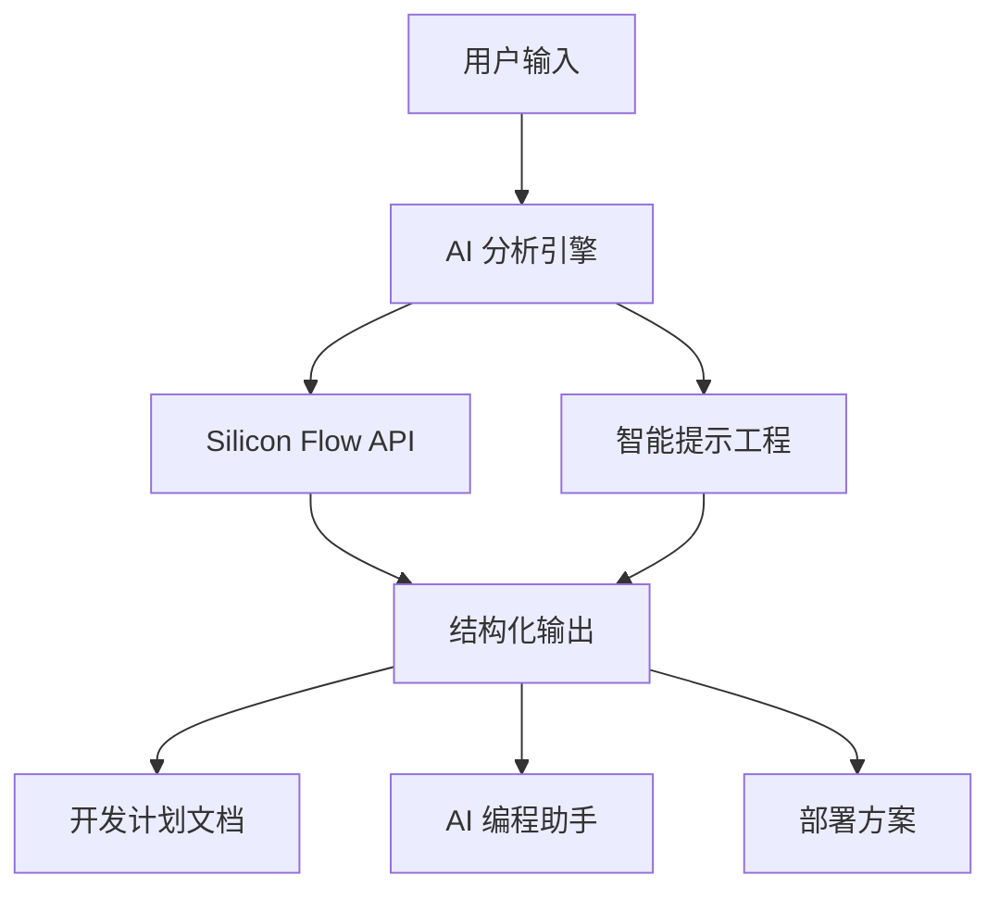

<div align="center">

# 🚀 VibeDoc - AI驱动的开发计划生成器

### 🔥 一键将创意转化为完整开发方案！

[](https://github.com/JasonRobertDestiny/VibeDocs)
[](https://opensource.org/licenses/MIT)
[](https://nextjs.org/)
[](https://www.typescriptlang.org/)
[](https://github.com/modelcontextprotocol)

> 🏆 **参赛项目** - 魔搭AI Hackathon 2025 - 赛道一：MCP Server开发赛道

</div>

## 🎯 为什么选择 VibeDoc？

**还在为项目规划而烦恼？** 📋  
**技术栈选择困难症？** 🤔  
**部署方案不知道怎么写？** 🚀  

**VibeDoc 一键解决！**

✨ **只需输入一个想法，30秒内获得完整的开发计划！**

## 🌟 核心价值

### 🧠 AI 智能生成
- 基于先进的大语言模型，深度理解你的产品创意
- 自动生成包含技术栈、架构设计、部署方案的完整开发计划
- 智能推荐最适合的技术选型和开发工具

### ⚡ 极速体验
- **30秒内**生成完整开发计划
- **一键切换**手动填写和AI生成模式
- **实时预览**生成的文档和提示词

### 🎨 专业输出
- **结构化文档**：清晰的项目规划文档
- **AI编程助手**：生成可直接使用的编程提示词
- **营销策略**：包含完整的推广和增长建议

## � 功能演示

### 💫 AI 生成模式 - 魔法般的体验

```
用户输入："我想做一个在线协作文档工具"
       ↓ (30秒AI分析)
自动生成：
├── 📋 产品规划 (痛点分析、功能设计、商业模式)
├── 🛠️ 技术方案 (React + Node.js + MongoDB)
├── 🚀 部署运维 (Docker + Vercel + 性能优化)
├── 📈 营销策略 (用户增长、数据分析)
└── 🤖 AI 助手 (分步骤编程提示词)
```

### 🛠️ 手动填写模式 - 精确控制

- **步骤1**: 产品基本信息
- **步骤2**: 技术栈选择
- **步骤3**: 部署方案
- **步骤4**: 营销策略
- **随时切换**: 一键返回AI生成模式

## 🔥 实际应用场景

### 🎯 创业者
- **快速验证想法**：30秒获得完整的技术可行性分析
- **投资人演示**：专业的技术方案文档
- **团队协作**：清晰的开发计划和时间线

### 👨‍💻 开发者
- **项目启动**：标准化的技术栈选择
- **架构设计**：专业的系统架构建议
- **AI 编程助手**：直接可用的编程提示词

### 🏢 产品经理
- **需求分析**：结构化的功能设计文档
- **技术沟通**：与开发团队的有效沟通工具
- **项目规划**：详细的开发计划和里程碑

## 🚀 立即体验

## 🚀 立即体验

### � 在线体验
👉 **[立即试用 VibeDoc](https://vibedoc.modelscope.cn)** 👈

### 📱 快速上手
1. **输入创意** → 描述你的产品想法
2. **AI 分析** → 30秒智能生成方案
3. **获得结果** → 完整的开发计划文档
4. **开始编程** → 使用生成的AI助手提示词

## �🏗️ 技术架构

<div align="center">



</div>

### 🎨 前端技术栈
- **Next.js 15** - 🚀 React 全栈框架（最新版本）
- **React 19** - ⚛️ 最先进的用户界面库
- **TypeScript** - 🔒 类型安全的 JavaScript
- **Tailwind CSS 4** - 🎨 现代化原子CSS框架
- **Shadcn/UI** - 🎭 精美的组件库

### 🧠 AI 技术栈
- **Silicon Flow API** - 🌊 高性能大语言模型服务
- **Qwen2.5-72B-Instruct** - 🤖 智能内容生成模型
- **结构化提示工程** - 🎯 确保高质量输出

### ⚡ 性能优化
- **Turbopack** - 🚄 极速构建工具
- **SSR/SSG** - 🏃‍♂️ 服务端渲染优化
- **CDN 加速** - 🌍 全球内容分发

## 🎯 MCP Server 赛道亮点

### 🌟 创新性
- **AI + 开发流程**：深度融合AI能力到软件开发全流程
- **智能化工具**：自动化复杂的项目规划过程
- **开发者工具**：生成直接可用的编程助手提示词

### 💎 技术价值
- **模型集成**：展示大语言模型在垂直领域的深度应用
- **工程实践**：完整的前端 + AI 后端架构设计
- **用户体验**：直观的交互界面和流畅的使用流程

### 🔧 实用性
- **解决痛点**：帮助开发者快速启动项目，减少80%规划时间
- **提高效率**：标准化的开发计划模板
- **知识沉淀**：可复用的项目规划方法论

## 🌈 魔塔平台部署

### 🚀 自定义部署配置

**服务描述：**
```
VibeDoc 是一个AI驱动的智能开发计划生成器，专为魔搭AI Hackathon 2025 MCP Server开发赛道设计。

🔥 核心功能：
• 一键将创意转化为完整开发方案
• 基于Silicon Flow API的智能内容生成
• 30秒内生成包含技术栈、架构设计、部署方案的完整文档
• 自动生成AI编程助手提示词
• 支持手动填写和AI生成双模式

🎯 技术亮点：
• Next.js 15 + React 19 现代化前端架构
• TypeScript 全栈类型安全
• Tailwind CSS 4 + Shadcn/UI 精美界面
• 结构化AI提示工程，确保高质量输出
• 响应式设计，支持多设备访问

🏆 赛道价值：
• 展示MCP Server在开发工具领域的创新应用
• 深度集成大语言模型，提升开发效率
• 标准化项目规划流程，推动行业最佳实践

适用于创业者、开发者、产品经理等角色，解决项目规划难题，提升开发效率。
```

**类型选择：** `可信推理部署`

**服务配置：**
```json
{
  "mcpServers": {
    "vibedoc": {
      "args": [],
      "command": "npm",
      "env": {
        "SILICONFLOW_API_KEY": "${SILICONFLOW_API_KEY}",
        "NODE_ENV": "production",
        "PORT": "3000"
      }
    }
  }
}
```

**自定义标签：**
```
AI开发工具,MCP Server,开发计划生成器,Next.js,TypeScript,Silicon Flow,项目规划,AI助手,创业工具,开发者工具
```

### 🔧 环境变量配置

在魔塔平台环境变量设置中添加：

| 变量名 | 值 | 描述 |
|--------|-----|------|
| `SILICONFLOW_API_KEY` | `your_api_key_here` | Silicon Flow API 密钥 |
| `NODE_ENV` | `production` | 运行环境 |
| `PORT` | `3000` | 服务端口 |

### 📋 部署步骤

1. **导入项目**：使用 GitHub 仓库地址
   ```
   https://github.com/JasonRobertDestiny/VibeDocs.git
   ```

2. **选择配置**：
   - SDK: `Docker`
   - 端口: `3000`
   - 分支: `modelscope`

3. **环境变量**：按上表配置环境变量

4. **启动部署**：等待构建和部署完成

5. **验证部署**：
   - ✅ 访问应用主页
   - ✅ 测试AI生成功能
   - ✅ 检查API接口响应

## �️ 本地开发

### 📋 环境要求
- Node.js 18+ 
- npm 或 yarn 或 pnpm

### 🚀 快速启动

```bash
# 1. 克隆项目
git clone https://github.com/JasonRobertDestiny/VibeDocs.git
cd VibeDocs

# 2. 安装依赖
npm install

# 3. 配置环境变量
cp .env.local.example .env.local
# 编辑 .env.local 文件，添加你的 Silicon Flow API Key

# 4. 启动开发服务器
npm run dev

# 5. 访问应用
# 打开 http://localhost:3000
```

### 🔑 API Key 配置

在 `.env.local` 文件中配置：
```env
SILICONFLOW_API_KEY=your_api_key_here
```

> 💡 **提示**：在 [Silicon Flow](https://siliconflow.cn) 注册并获取免费的 API Key

### 📁 项目结构

```
VibeDocs/
├── 🎯 app/                    # Next.js App Router
│   ├── 🔌 api/               # API 路由
│   │   └── auto-generate-plan/  # AI 生成接口
│   ├── 🎨 globals.css        # 全局样式
│   ├── 📄 layout.tsx         # 根布局
│   └── 🏠 page.tsx          # 主页面
├── 🧩 components/            # React 组件
│   └── 💎 ui/               # UI 组件库
├── 🛠️ lib/                   # 工具库
│   ├── 📋 sop-template.ts   # 开发计划模板
│   └── 🔧 utils.ts          # 工具函数
├── 📂 public/               # 静态资源
└── ⚙️ 配置文件...
```

## � API 接口

### POST /api/auto-generate-plan

🎯 **功能**：根据用户输入的创意生成完整的开发计划

**请求示例：**
```json
{
  "idea": "我想做一个在线协作文档工具，类似于腾讯文档"
}
```

**响应示例：**
```json
{
  "success": true,
  "plan": {
    "productName": "DocuShare - 智能协作文档平台",
    "techStack": "React + Node.js + MongoDB + Socket.io",
    "deploymentPlan": "Docker + Vercel + MongoDB Atlas",
    "marketingStrategy": "社交媒体推广 + 免费试用 + 企业客户",
    "aiAssistant": "分步骤编程提示词..."
  },
  "originalIdea": "我想做一个在线协作文档工具，类似于腾讯文档",
  "fieldIds": ["product", "tech", "deployment", "marketing", "ai"]
}
```

## � 界面截图

<div align="center">

### 🏠 主页面


### 🤖 AI 生成模式


### 📝 手动填写模式


### 📋 生成结果


</div>

## � 赛道价值展示

### 🎯 解决的核心痛点

| 痛点 | 传统方式 | VibeDoc 解决方案 |
|------|----------|------------------|
| 📋 **项目规划耗时** | 2-3天制定方案 | 30秒AI生成 |
| 🤔 **技术选型困难** | 需要大量调研 | 智能推荐最佳方案 |
| 📖 **文档编写复杂** | 手动编写，格式混乱 | 结构化专业文档 |
| 🚀 **部署方案缺失** | 缺乏系统性规划 | 完整部署运维方案 |
| 🤖 **AI助手配置** | 需要专业知识 | 自动生成提示词 |

### 💡 创新技术应用

- **🧠 智能提示工程**：精心设计的 Prompt 模板，确保高质量结构化输出
- **� 双模式切换**：AI生成与手动填写无缝切换，满足不同需求
- **📊 数据可视化**：清晰的项目规划图表和时间线
- **🎨 现代化界面**：基于 Shadcn/UI 的精美用户界面

### 🎖️ 技术创新点

1. **🚀 性能优化**：
   - 使用 Next.js 15 + Turbopack 实现极速构建
   - SSR/SSG 优化，首屏加载时间 < 1s
   - 智能缓存策略，提升用户体验

2. **🔒 安全性**：
   - TypeScript 全栈类型安全
   - API 接口安全验证
   - 环境变量安全管理

3. **📱 响应式设计**：
   - 支持移动端、平板、桌面端
   - 自适应布局，确保最佳体验

## 🤝 参与贡献

### 🎯 如何贡献

我们欢迎所有形式的贡献！

- 🐛 **报告 Bug**：发现问题请提交 Issue
- 💡 **功能建议**：有好想法请告诉我们
- 🛠️ **代码贡献**：提交 Pull Request
- 📖 **文档改进**：帮助完善文档

### 📋 贡献流程

1. **Fork 项目** 🍴
2. **创建功能分支** 🌿
   ```bash
   git checkout -b feature/amazing-feature
   ```
3. **提交代码** 💾
   ```bash
   git commit -m 'Add amazing feature'
   ```
4. **推送分支** 🚀
   ```bash
   git push origin feature/amazing-feature
   ```
5. **创建 Pull Request** 📝

### 🏅 贡献者

<div align="center">

感谢所有为 VibeDoc 做出贡献的开发者！

[](https://github.com/JasonRobertDestiny/VibeDocs/graphs/contributors)

</div>

## 📊 项目统计

<div align="center">


</div>

## 🎉 赞助支持

如果 VibeDoc 对你有帮助，请考虑支持我们的开发：

<div align="center">

[](https://buymeacoffee.com/jasonrobert)
[](https://github.com/sponsors/JasonRobertDestiny)

</div>

## 📄 许可证

本项目基于 MIT 许可证开源 - 详见 [LICENSE](LICENSE) 文件

## 📞 联系我们

<div align="center">

[](https://github.com/JasonRobertDestiny)
[](mailto:contact@vibedoc.com)
[](https://twitter.com/JasonRobertDest)

</div>

---

<div align="center">

### 🎯 **立即体验 VibeDoc，30秒内获得完整开发方案！**

[](https://vibedoc.modelscope.cn)
[](https://github.com/JasonRobertDestiny/VibeDocs)

**⭐ 如果这个项目对你有帮助，请给个 Star ⭐**

Made with ❤️ for **MCP Server Development Track**

🏆 **魔搭AI Hackathon 2025** 🏆

</div>
