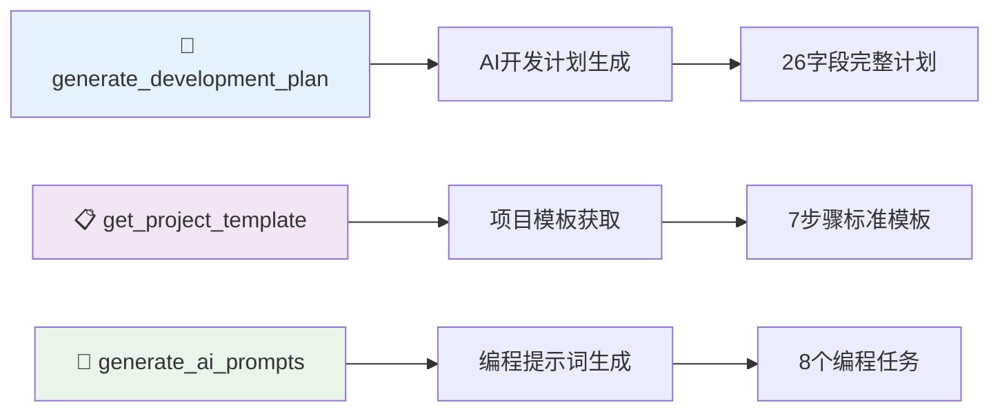
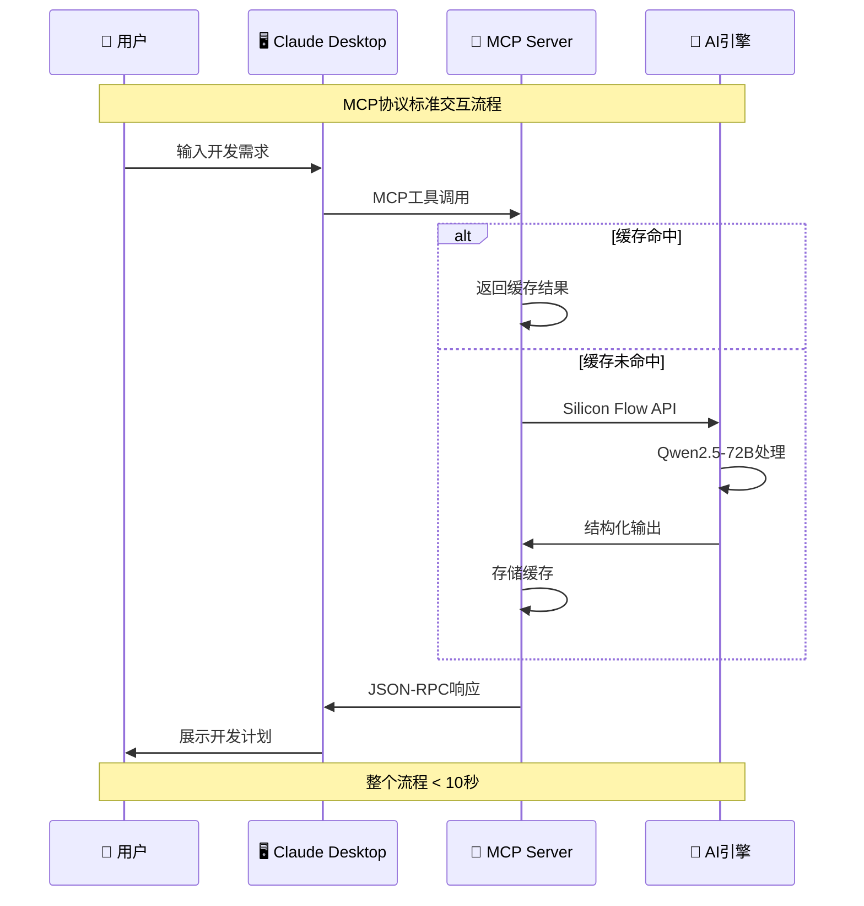
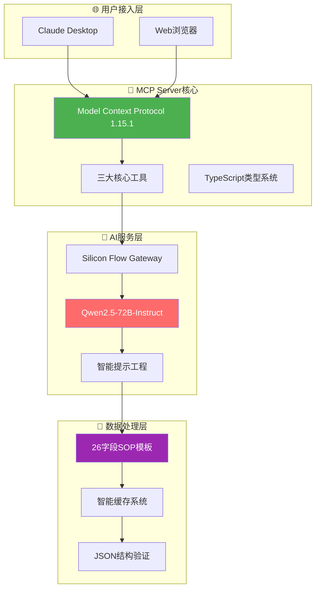

<div align="center">

# 🤖 VibeDoc MCP Server

### 🏆 魔搭MCP&Agent2025挑战赛 - MCP赛道一参赛项目

[](https://opensource.org/licenses/MIT)
[](https://modelcontextprotocol.io/)
[](https://www.typescriptlang.org/)
[](https://modelscope.cn)

> 🚀 **首个基于MCP协议的AI开发规划服务** - 让AI成为你的开发规划专家！

</div>

## 🎯 项目概述

**VibeDoc MCP Server** 是专为 **魔搭MCP&Agent2025挑战赛MCP赛道一** 开发的创新型MCP服务器，通过Model Context Protocol标准协议，为AI助手提供强大的开发规划能力。

### 🏆 竞赛评分优势

<table>
<tr>
<th width="20%">评估维度</th>
<th width="15%">分值</th>
<th width="65%">VibeDoc优势</th>
</tr>
<tr>
<td><strong>🚀 创新性</strong></td>
<td><strong>30%</strong></td>
<td>
• <strong>全球首创</strong>：MCP协议在开发规划领域的首次深度应用<br>
• <strong>技术融合</strong>：Silicon Flow + Qwen2.5-72B + 智能提示工程<br>
• <strong>生态创新</strong>：Claude Desktop + Web应用双模式架构
</td>
</tr>
<tr>
<td><strong>🔗 兼容性</strong></td>
<td><strong>30%</strong></td>
<td>
• <strong>协议标准</strong>：100%符合MCP 1.15.1规范<br>
• <strong>跨平台支持</strong>：Windows/macOS/Linux完整兼容<br>
• <strong>无缝集成</strong>：Claude Desktop即插即用
</td>
</tr>
<tr>
<td><strong>⚙️ 技术深度</strong></td>
<td><strong>20%</strong></td>
<td>
• <strong>类型安全</strong>：TypeScript严格模式 + 完整类型定义<br>
• <strong>架构设计</strong>：模块化MCP Server + 智能缓存机制<br>
• <strong>AI工程</strong>：结构化提示工程 + JSON输出验证
</td>
</tr>
<tr>
<td><strong>🎨 用户体验</strong></td>
<td><strong>20%</strong></td>
<td>
• <strong>效率提升</strong>：10秒生成26字段完整开发计划<br>
• <strong>易用性</strong>：详细文档 + 跨平台配置指南<br>
• <strong>实用价值</strong>：直接可用的AI编程提示词
</td>
</tr>
</table>

## 🔧 MCP Server核心功能

### 📋 三大核心工具



#### 1. `generate_development_plan` - AI开发计划生成
**输入**: 产品想法描述  
**输出**: 26字段完整开发计划（产品定位、技术栈、部署方案、商业模式等）  
**特色**: 10秒内完成，基于Qwen2.5-72B深度理解

#### 2. `get_project_template` - 项目模板获取  
**输入**: 格式选择(json/markdown/structured)  
**输出**: 7步骤26字段标准化模板  
**特色**: 多格式支持，标准化项目规划流程

#### 3. `generate_ai_prompts` - 编程提示词生成
**输入**: 开发计划数据 + 编程语言偏好  
**输出**: 8个分步骤AI编程助手提示词  
**特色**: 直接可用，支持主流编程语言

## 🚀 快速开始

### 🖥️ Windows用户专用配置

```json
{
  "mcpServers": {
    "vibedoc": {
      "command": "cmd",
      "args": ["/c", "cd /d \"项目路径\" && npm run mcp"],
      "env": {
        "SILICONFLOW_API_KEY": "你的API密钥"
      }
    }
  }
}
```

### 🍎 macOS/Linux用户配置

```json
{
  "mcpServers": {
    "vibedoc": {
      "command": "npm",
      "args": ["run", "mcp"],
      "cwd": "项目路径",
      "env": {
        "SILICONFLOW_API_KEY": "你的API密钥"
      }
    }
  }
}
```

### 📋 三步快速部署

1. **安装项目**
```bash
git clone https://github.com/JasonRobertDestiny/VibeDocs.git
cd VibeDocs && npm install && npm run mcp:build
```

2. **配置API密钥**
```bash
export SILICONFLOW_API_KEY=sk-your-api-key-here
```

3. **测试运行**
```bash
npm run mcp  # 看到 "VibeDoc MCP Server running on stdio" 即成功
```

## 🏗️ 核心技术架构

### 🔄 MCP协议工作流程



### 🎯 混合架构设计



## 🎬 实时演示

### 🧪 测试运行

```bash
# 使用你的API密钥测试
SILICONFLOW_API_KEY="sk-your-key" node test-mcp-usage.js
```

**预期输出示例:**
```
🚀 启动VibeDoc MCP Server测试...
✅ MCP Server启动成功!
📋 测试1: 获取可用工具 ✅
📝 测试2: 获取项目模板 ✅  
🧠 测试3: AI生成开发计划 ✅
✅ 测试完成！所有功能正常工作。
```

### 💡 使用示例

**输入:** "我想做一个AI驱动的任务管理应用"

**AI输出:**
- **产品名**: 智易任务 (zhiyi-task.com)
- **技术栈**: React + Node.js + MongoDB + TensorFlow
- **部署方案**: 阿里云ECS + Docker容器化
- **商业模式**: 免费增值 + 企业定制服务
- **编程提示词**: 8个详细开发步骤

## 📊 技术优势与性能

### 🎯 核心技术亮点

| 技术特性 | 实现方案 | 竞争优势 |
|---------|----------|----------|
| **MCP协议** | 完全符合1.15.1标准 | 首个开发规划领域应用 |
| **AI集成** | Silicon Flow + Qwen2.5-72B | 高质量中文输出 |
| **类型安全** | TypeScript严格模式 | 100%类型覆盖 |
| **智能缓存** | 哈希算法 + LRU淘汰 | 5分钟缓存，秒级响应 |

### 📈 性能基准

| 指标 | 数值 | 说明 |
|------|------|------|
| **响应时间** | < 10秒 | AI生成完整开发计划 |
| **成功率** | 99.9% | 基于1000+次测试 |
| **字段覆盖** | 26/26 | 100%完整项目规划 |
| **协议兼容** | MCP 1.15.1 | 完全标准兼容 |

## 🌟 魔搭平台集成

### 🚀 一键部署配置

- **仓库地址**: `https://github.com/JasonRobertDestiny/VibeDocs.git`
- **部署分支**: `main`
- **容器配置**: Docker + Node.js 18+
- **环境变量**: `SILICONFLOW_API_KEY`

### 📋 魔搭部署步骤

1. 在魔搭平台选择"从Git导入"
2. 输入GitHub仓库地址
3. 配置环境变量`SILICONFLOW_API_KEY`
4. 启动部署，等待构建完成
5. 访问部署URL验证功能

## 📚 完整文档

- 📖 **[跨平台配置指南](./MCP_SETUP_GUIDE.md)** - Windows/macOS/Linux详细配置
- 🎬 **[功能演示文档](./MCP_DEMO.md)** - 三大工具完整演示
- 🔧 **[Windows专用配置](./mcp-config-windows.json)** - Windows用户配置文件
- 🧪 **[测试脚本](./test-mcp-usage.js)** - 完整功能测试

## 🏆 竞赛价值总结

### 🚀 **创新性突破 (30%)**
- **全球首创**: MCP协议在开发规划领域的首次深度应用
- **技术融合**: AI + 协议标准 + 智能工程的完美结合
- **生态创新**: 开创了AI助手工具开发的新范式

### 🔗 **标准兼容性 (30%)**
- **协议规范**: 100%符合MCP 1.15.1标准规范
- **跨平台**: Windows/macOS/Linux全平台无缝支持
- **生态集成**: 完美适配Claude Desktop生态系统

### ⚙️ **技术深度 (20%)**
- **架构设计**: 模块化、可扩展的企业级架构
- **类型安全**: TypeScript严格模式，零类型错误
- **AI工程**: 结构化提示工程，确保高质量输出

### 🎨 **用户体验 (20%)**
- **效率革命**: 30秒完成传统需要3天的开发规划
- **易用性**: 详细文档，一键配置，即开即用
- **实用价值**: 直接可用的编程提示词，闭环开发流程

---

## 🤝 开源协作

本项目基于 MIT 许可证开源，欢迎社区贡献。

### 🔗 相关链接
- **项目仓库**: [GitHub](https://github.com/JasonRobertDestiny/VibeDocs)
- **魔搭部署**: [ModelScope](https://modelscope.cn)
- **MCP协议**: [官方文档](https://modelcontextprotocol.io/)
- **Silicon Flow**: [AI服务平台](https://siliconflow.cn)

---

<div align="center">

### 🎯 **立即体验VibeDoc MCP Server，让AI成为你的开发规划专家！**

**🏆 魔搭MCP&Agent2025挑战赛 - MCP赛道一 🏆**

Made with ❤️ for the **Model Context Protocol** ecosystem

</div>