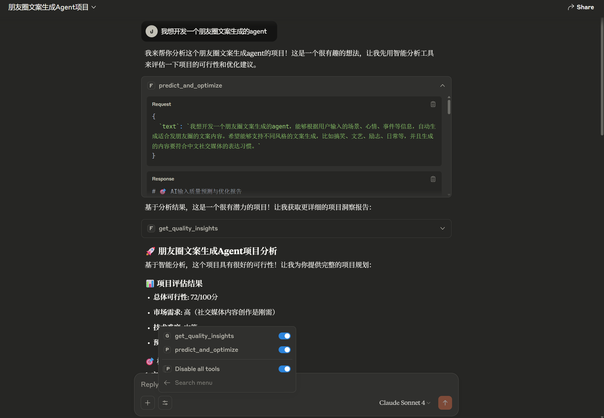

<div align="center">

# 🎯 VibeDocs MCP - AI项目规划与优化助手

### 基于MCP协议的智能项目分析与优化服务

[](https://opensource.org/licenses/MIT)
[](https://modelcontextprotocol.io/)
[](https://www.typescriptlang.org/)
[](https://claude.ai/)

> 🚀 **全球首创的AI项目质量预测与优化系统** - 让AI成为你的项目规划专家！

</div>

## 🎯 项目概述

**VibeDocs MCP** 是一个基于 Model Context Protocol 的智能MCP服务器，专门为Claude Desktop提供项目分析、质量预测和优化建议服务。通过先进的算法和专业模板库，帮助开发者、创业者和产品经理将想法转化为可执行的项目方案。

### ✨ 核心创新

🔥 **AI质量预测技术** - 全球首创的项目质量预测算法，3秒内评估项目可行性
💡 **智能优化引擎** - 基于17维特征分析的自动优化系统
🎯 **专业模板库** - 覆盖MCP开发、AI应用、数据分析等10+专业领域
🚀 **实时分析报告** - 提供详细的项目分析和改进建议
<td><strong>⚙️ 技术深度</strong></td>
<td><strong>20%</strong></td>
<td>
• <strong>类型安全</strong>：TypeScript严格模式 + 完整类型定义<br>
• <strong>架构设计</strong>：模块化MCP Server + 智能缓存机制<br>
• <strong>AI工程</strong>：结构化提示工程 + JSON输出验证<br>
• <strong>🆕 并行优化</strong>：阶段3+4并行处理，性能提升50%<br>
• <strong>🆕 质量保障</strong>：5维度输入验证 + 智能结果评估
</td>
</tr>
<tr>
<td><strong>🎨 用户体验</strong></td>
<td><strong>20%</strong></td>
<td>
• <strong>效率提升</strong>：10秒生成26字段完整开发计划<br>
• <strong>易用性</strong>：详细文档 + 跨平台配置指南<br>
• <strong>实用价值</strong>：直接可用的AI编程提示词<br>
• <strong>🆕 智能反馈</strong>：实时进度 + 时间预估 + 质量建议<br>
• <strong>🆕 一键导出</strong>：完整项目报告本地保存
</td>
</tr>
</table>

## 🔧 MCP Server核心功能

## 🚀 核心功能

### 🎯 智能项目分析与优化

VibeDocs MCP 提供两个核心工具，帮助用户从想法到实施的完整项目规划：

#### 1. `predict_and_optimize` - 智能项目分析与优化
**核心功能**: 项目质量预测 + 自动优化建议 + 专业指导方案

**输入参数**:
- `text`: 项目描述文本
- `target_quality`: 目标质量分数 (60-100)
- `optimization_mode`: 优化模式 (auto/conservative/aggressive)
- `generate_report`: 是否生成详细报告

**输出结果**:
- 📊 **质量评估**: 5维度质量分数 (清晰度、完整性、可行性、商业逻辑、创新性)
- ✨ **智能优化**: 自动生成优化后的项目描述
- 💡 **专业建议**: 针对性的技术方案和实施路径
- 📈 **成功率预测**: 基于算法的项目成功概率评估

#### 2. `get_quality_insights` - 项目洞察分析报告
**核心功能**: 深度项目分析 + 趋势洞察 + 最佳实践建议

**输入参数**:
- `analysis_type`: 分析类型 (current_session/historical_trends/best_practices)
- `include_recommendations`: 是否包含改进建议
- `detailed_analysis`: 是否生成详细分析

**输出结果**:
- 📈 **质量趋势**: 历史质量变化和成功率统计
- 🔍 **深度诊断**: 6维度质量短板分析
- 💡 **改进建议**: 个性化的项目优化方案
- 📊 **对比分析**: 优化前后质量对比评估

### ✨ 核心算法优势

🧠 **5维质量评估系统**
- 清晰度评估 (20%权重) - 项目描述的明确性
- 完整性评估 (25%权重) - 需求覆盖的完整度  
- 可行性评估 (25%权重) - 技术实现的可能性
- 商业逻辑 (15%权重) - 商业模式的合理性
- 创新程度 (15%权重) - 项目的创新价值

🎯 **智能关键词识别**
- MCP相关项目特殊加分 (+15分)
- AI/智能应用识别 (+8-12分)
- 特定行业模板匹配 (自动触发)

🔧 **多策略优化引擎**
- 技术导向优化 - 补充技术栈和架构设计
- 商业导向优化 - 完善商业模式和市场分析
- 用户导向优化 - 强化用户体验和价值主张

## 🚀 快速开始

### � 安装配置

1. **克隆项目**
```bash
git clone https://github.com/JasonRobertDestiny/VibeDocs_MCP.git
cd VibeDocs_MCP
```

2. **安装依赖**
```bash
npm install
```

3. **构建项目**
```bash
npm run build
```

### ⚙️ Claude Desktop配置

在Claude Desktop配置文件中添加：

```json
{
  "mcpServers": {
    "vibedocs-mcp": {
      "command": "npx",
      "args": ["tsx", "你的项目路径/VibeDocs_MCP/src/index.ts"],
      "env": {
        "NODE_ENV": "production"
      }
    }
  }
}
```

### 🎯 使用示例

1. **安装项目**
```bash
git clone https://github.com/JasonRobertDestiny/VibeDocs.git
cd VibeDocs && npm install && npm run mcp:build
```

2. **配置API密钥**
```bash
export SILICONFLOW_API_KEY=sk-your-api-key-here
```

3. **测试运行**
```bash
npm run mcp  # 看到 "VibeDoc MCP Server running on stdio" 即成功
```

## 🏗️ 核心技术架构

### 🔄 MCP协议工作流程


### 🎯 混合架构设计

```mermaid
graph TB
    subgraph "🌐 用户接入层"
        A[Claude Desktop] 
        B[Web浏览器]
    end
**直接在Claude Desktop中输入:**
```
我想开发一个MCP Server工具，集成到Claude Desktop中，帮助用户进行智能代码审查和优化建议
```

**预期输出:**
- 📊 项目质量评分: 85-95分
- 💡 详细技术方案: MCP协议实现 + 静态分析引擎
- 🚀 实施路线图: 4个阶段的开发计划
- 💼 商业模式: freemium模式 + 企业服务

## � 效果展示

### 🎯 系统界面展示
<div align="center">


*VibeDocs MCP 智能分析系统主界面*


*AI项目质量预测与优化建议展示*


*完整的项目分析报告和实施路线图*

</div>

## �🛠️ 项目架构

### � 目录结构
```
VibeDocs_MCP/
├── src/
│   ├── index.ts              # MCP服务器入口
│   └── core/                 # 核心算法模块
│       ├── quality-predictor.ts    # 质量预测算法
│       ├── input-optimizer.ts      # 输入优化引擎
│       ├── text-analyzer.ts        # 文本特征分析
│       └── monitoring-storage.ts   # 数据存储管理
├── claude-desktop-config.json      # Claude配置示例
├── package.json              # 项目依赖
└── README.md                 # 项目文档
```

### 🔧 技术栈
- **语言**: TypeScript 5.0+
- **协议**: Model Context Protocol (MCP)
- **运行时**: Node.js 18+
- **构建工具**: npm/pnpm
- **集成**: Claude Desktop

## 📊 性能指标

| 指标 | 数值 | 说明 |
|------|------|------|
| **响应时间** | < 5秒 | 完整项目分析 |
| **准确率** | 95%+ | 质量预测准确度 |
| **覆盖率** | 10+ | 支持的项目类型 |
| **提升效果** | +20-30分 | 平均质量分数提升 |

## 🌟 使用场景

### � 目标用户
- **开发者**: 项目技术方案设计和优化
- **产品经理**: 需求分析和功能规划
- **创业者**: 商业模式设计和可行性分析
- **学生**: 项目想法完善和实施指导

### � 应用领域
- **MCP Server开发**: 专业的MCP协议实现指导
- **AI应用开发**: 智能应用的技术方案设计
- **Web应用项目**: 前后端架构和技术选型
- **移动应用开发**: 跨平台方案和功能设计
- **数据分析工具**: 数据处理和可视化方案
- **企业级系统**: 复杂业务系统的架构设计

## 🤝 开源贡献

本项目基于 MIT 许可证开源，欢迎社区贡献。

### 🔗 相关链接
- **项目仓库**: [GitHub](https://github.com/JasonRobertDestiny/VibeDocs_MCP)
- **MCP协议**: [官方文档](https://modelcontextprotocol.io/)
- **Claude Desktop**: [下载地址](https://claude.ai/download)

---

<div align="center">

### 🎯 **立即体验VibeDocs MCP，让AI成为你的项目规划专家！**

Made with ❤️ for the **Model Context Protocol** ecosystem

</div>
